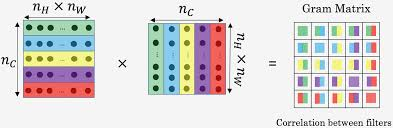
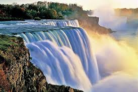
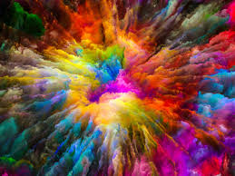
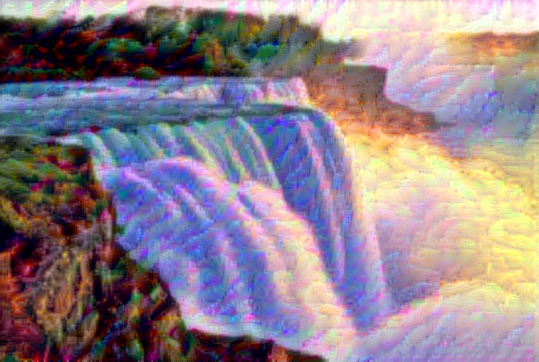

# Neural-Style-Transfer
<h1><strong>Motivation</strong></h1>

Neural style transfer is an optimization technique used to take two images, a content image and a style reference image (such as an artwork by a famous painter), and blend them together such that content image is now “painted” in the style of the style image.This is a technique outlined in <strong>Leon A. Gatys’ paper, A Neural Algorithm of Artistic Style</strong>, which is a great read, and you should definitely check it out.

  
https://arxiv.org/abs/1508.06576

<h1><strong>Implementation</strong></h1>
<h2><strong>Model Architecture : VGG19(Pre-trained)</strong></h1>

<h2><strong>Loss Functions</strong></h1>

<h4><strong>Gram Matrix </strong></h1>

<h1><strong>Results</strong></h1>
<h2><strong>Content Image</strong></h1>

<h2><strong>Style Image:</strong></h1>

<h2><strong>Reconstructed Image: </strong></h2>

<h1><strong>SUMMARY: </strong></h1>

<ul><li>The task was accomplished using PyTorch on Google Colab with GPU.</li>
  <li>We take pretrained VGG19 model & apply our Total variation Loss Functions as illustrated earlier using Gram matrix for Style Loss.</li>
  <li> The final Image is formed as per our choice of weighting ratio of <strong>content_weight/style/weight</strong>.
