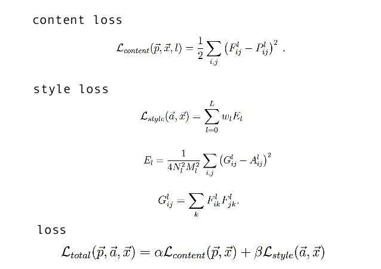

# Neural-Style-Transfer
<h1><strong>Motivation</strong></h1>

Neural style transfer is an optimization technique used to take three images, a content image, a style reference image (such as an artwork by a famous painter), and the input image you want to style — and blend them together such that the input image is transformed to look like the content image, but “painted” in the style of the style image.This is a technique outlined in Leon A. Gatys’ paper, A Neural Algorithm of Artistic Style, which is a great read, and you should definitely check it out.

  
https://arxiv.org/abs/1508.06576

<h1><strong>What actually do we do ????</strong></h1>

<h1><strong>Implementation</strong></h1>
<h2><strong>Model Architecture : VGG19(Pre-trained)</strong></h1>

<h2><strong>Loss Functions</strong></h1>

<h4><strong>Gram Matrix </strong></h1>

<h1><strong>Results</strong></h1>
<h2><strong>Content Image</strong></h1>

<h2><strong>Style Image:</strong></h1>

<h2><strong>Reconstructed Image: </strong></h2>

